---

## 📁 `README.ar.md` — استبدل كاملاً

```md
# 🏨 هلا ستاي — منصة حجز الفنادق والشقق والقاعات

[English](README.md) | [العربية](README.ar.md)

منصة حجز وإدارة فنادق حديثة وآمنة، مصممة للسوقين السعودي واليمني — تحل مشكلة ازدواج الحجوزات وتوحّد مراجعة الدفعات اليدوية في دورة واحدة متماسكة.

## 🌟 الميزات المنجزة (v2.0.0)

### للسائح
- 🔍 بحث بالمدينة والتواريخ والضيوف مع فلاتر حية (نوع الإقامة، النجوم، التقييم)
- 📅 محرك توفر لحظي: قاعدة السعة + منع التعارض + حجز الوحدات منذ إنشاء الحجز
- 🧾 لوحة حجوزاتي ولوحة شخصية (إحصاءات + الإقامة القادمة)
- 💳 دورة دفع مع رفع الإشعار وسجل حالات كامل
- 🔔 إشعارات داخلية مع كل تغيير حالة

### لصاحب الفندق
- 🏨 دورة حياة الفندق: إنشاء ← اعتماد الأدمن ← ظهور في البحث
- 🛠️ إدارة أنواع الإقامة مع رفع الصور
- 🧾 طابور الحجوزات: تأكيد / رفض مع سبب يصل للسائح
- 💳 طابور مراجعة الدفعات: اعتماد / رفض مع معاينة الإشعار
- 📊 لوحة تحليلات المالك (الحجوزات بالحالة + الإيراد الشهري)

### للأدمن
- ✅ اعتماد الفنادق مع إحصاءات حية للمنصة
- 👥 إدارة المستخدمين: بحث، فلتر أدوار، إيقاف وتفعيل
- 🌍 إدارة المدن وطرق الدفع
- 📊 إشراف شامل على الحجوزات والدفعات برسوم بيانية

### على مستوى المنصة
- 🔐 مصادقة Sanctum بثلاثة أدوار وسياسات صلاحيات
- 🎨 نظام تصميم عربي: رموز SCSS، خط Tajawal، وضع ليلي محفوظ
- 🧩 مكتبة مكونات: نوافذ حوارية، تنبيهات، هياكل تحميل، وتقويم عربي
- 🌐 ثنائية لغة كاملة AR/EN مع قلب RTL/LTR (vue-i18n) محفوظة لكل زائر
- 📱 PWA: بيان تثبيت + كاش Service Worker + حزم أداء (صور كسولة، gzip، كاش أصول)
- ♿ إمكانية وصول: حلقات تركيز، احترام تقليل الحركة، إيحاءات صادقة
- ⚡ حدود معدل، كاش مرجعي بإبطال ذكي، ترويسات أمان
- 🧪 20 اختبار Feature آلياً بـ PHPUnit
- 🐳 نشر Docker بأمر واحد (MySQL + API + Nginx)

## 📸 لقطات الشاشة

### رحلة السائح
| الرئيسية (عربي · نهاري · RTL) | الرئيسية (إنجليزي · ليلي · LTR) |
|---|---|
| 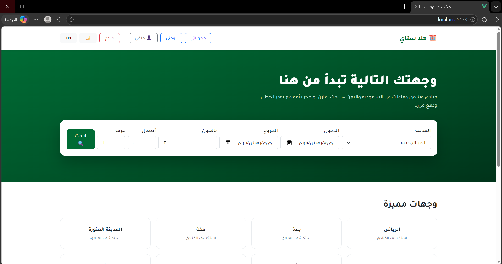 | 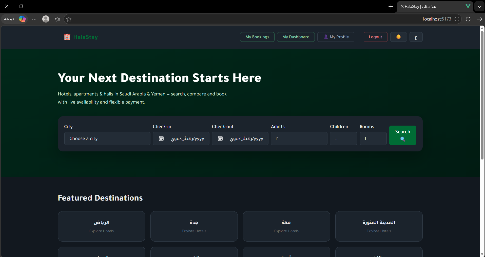 |

| البحث والفلاتر الحية | صفحة الفندق: معرض + ودجت الحجز اللاصق |
|---|---|
| 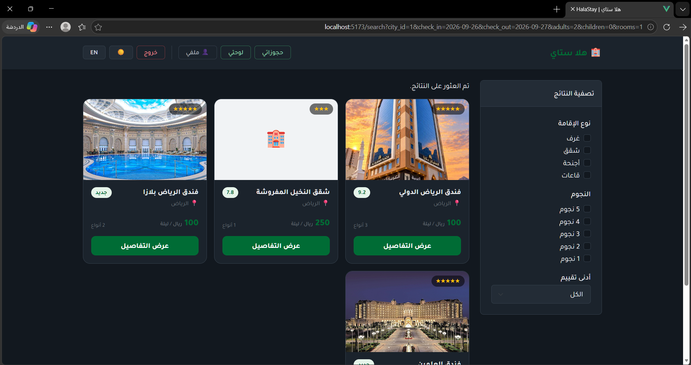 | 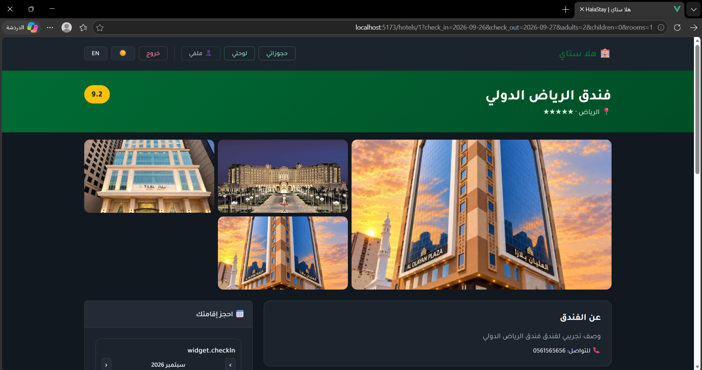 |

| صفحة الفندق: التقويم العربي | تفاصيل الحجز ولوحة إتمام الدفع |
|---|---|
| 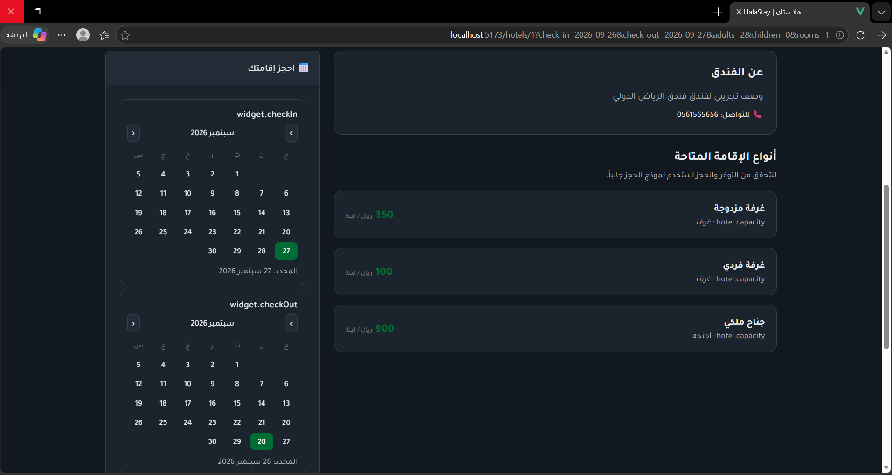 | 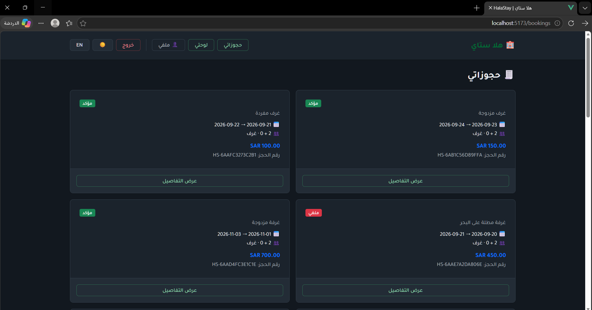 |

| لوحة السائح (إحصاءات + إقامة قادمة) | ملفي (الاسم والجوال) |
|---|---|
|  | 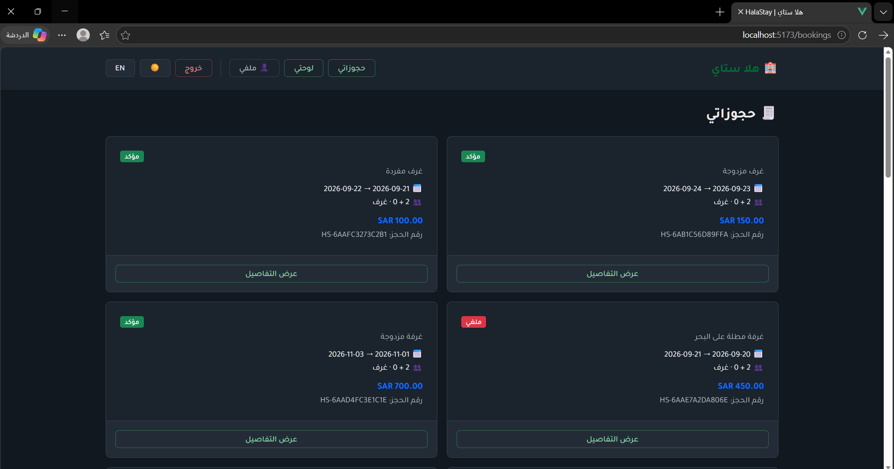 |

### عمليات المالك والأدمن — جنباً إلى جنب
| لوحة تحليلات المالك | لوحة تحليلات الأدمن |
|---|---|
| 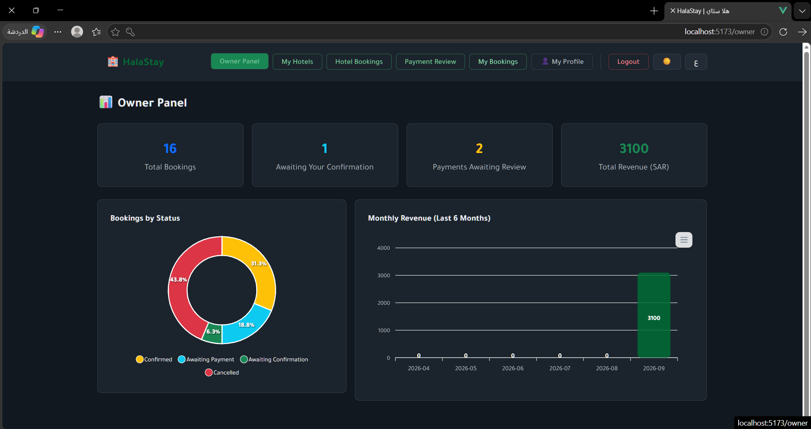 | 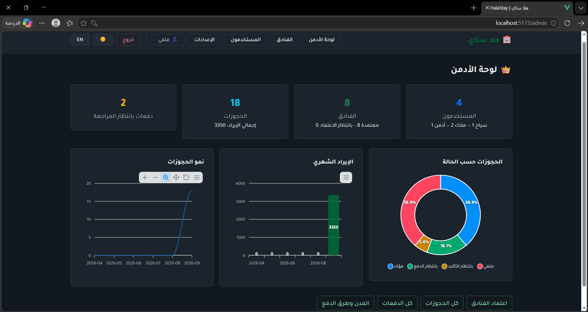 |

| قائمة فنادقي | إدارة المستخدمين |
|---|---|
| 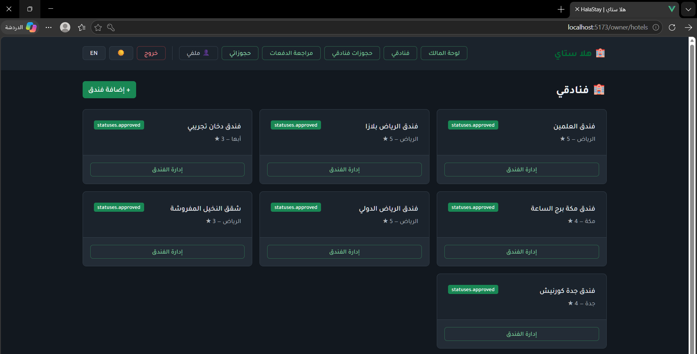 | 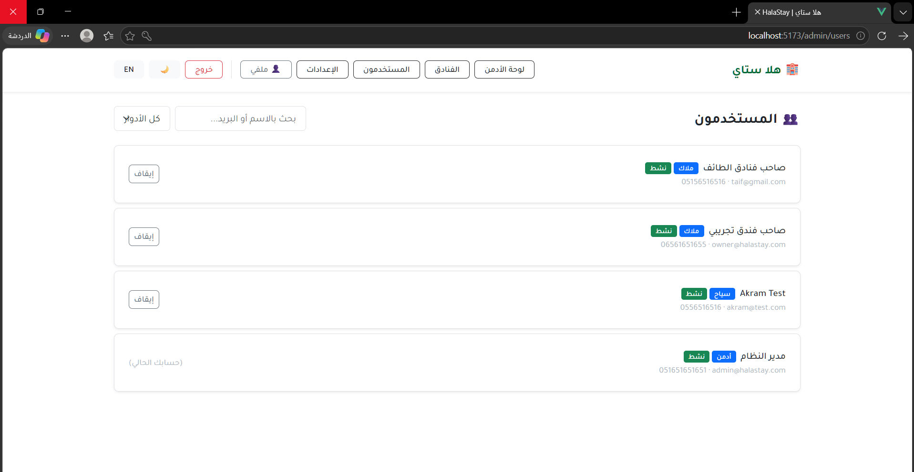 |

| إدارة الفندق (بيانات، صور، أنواع) | إعدادات المنصة (المدن وطرق الدفع) |
|---|---|
| 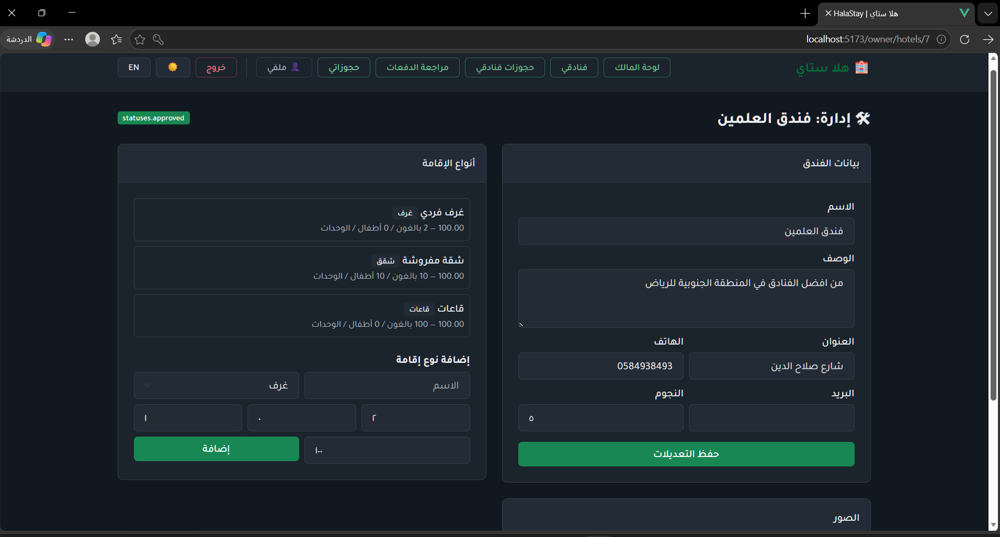 | 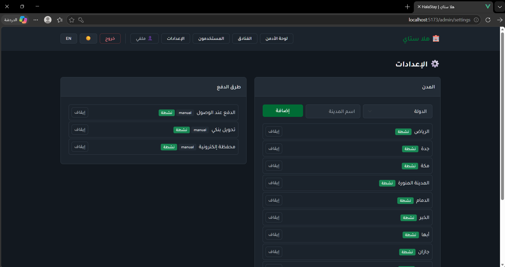 |

| طابور حجوزات المالك (تأكيد / رفض) | جدول كل الحجوزات (بحث وفلتر حالات) |
|---|---|
| 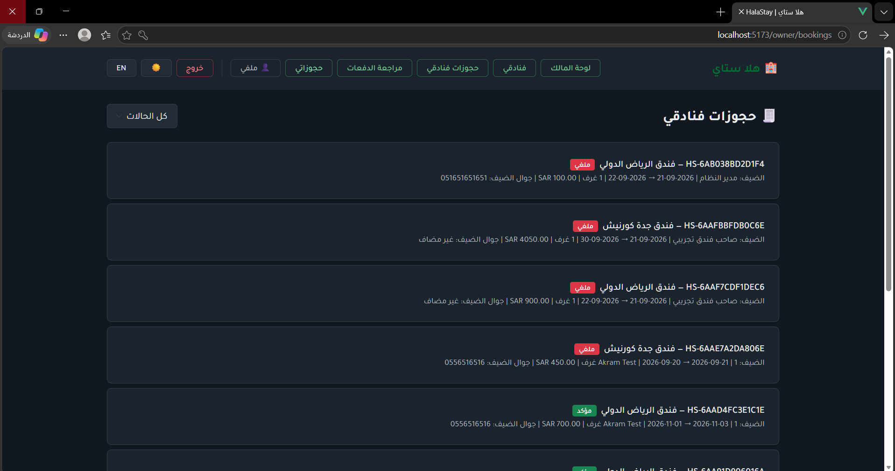 | 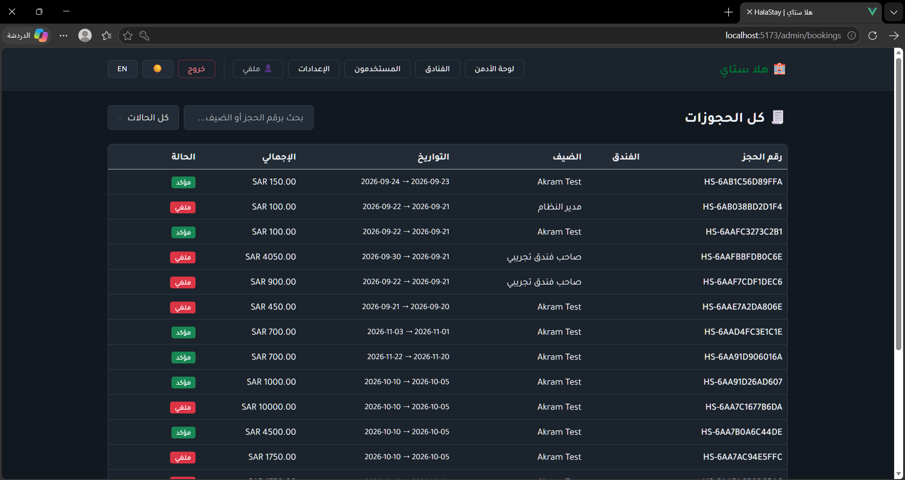 |

| طابور مراجعة دفعات المالك | إشراف الأدمن على كل الدفعات |
|---|---|
| 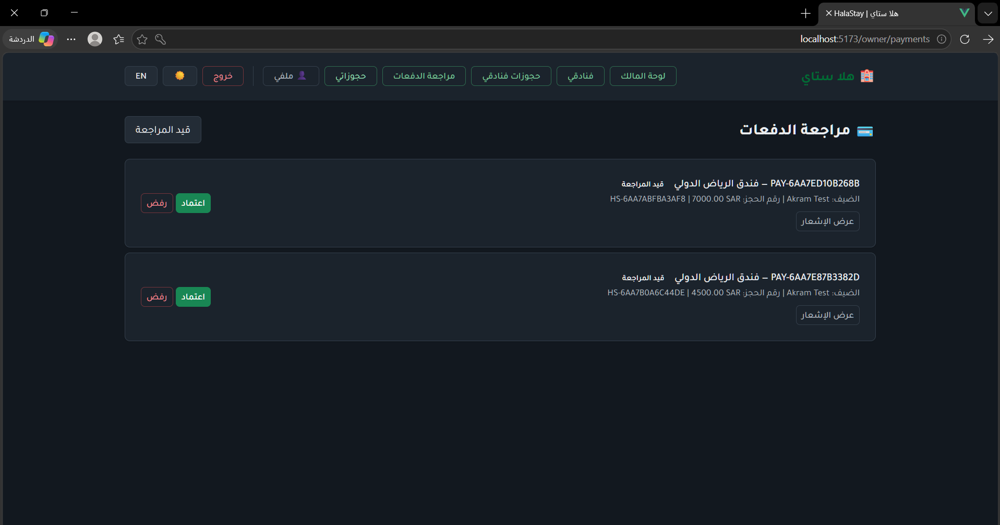 | 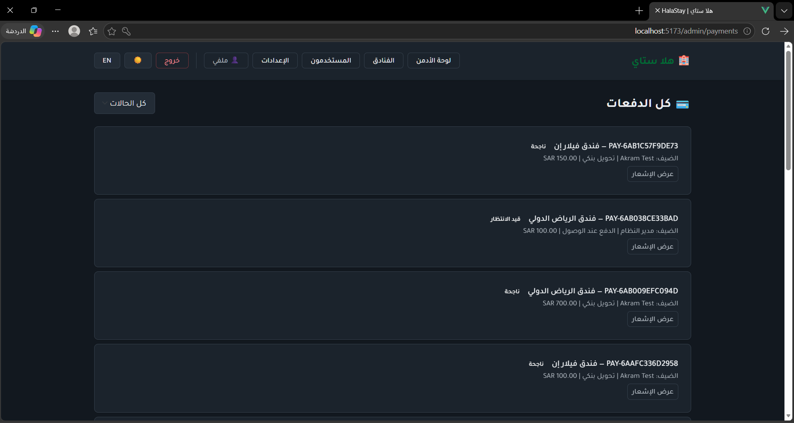 |

## 🗺️ خارطة الطريق
- ⭐ نظام مراجعات وتقييمات يكتبه الضيوف ويُجمّع في review_score
- 💳 بوابات دفع: 🇸 مدى وApple Pay · 🇾 ميزة واي كاش · 🌍 Stripe وPayPal
- ⏳ مهمة مجدولة لإنهاء صلاحية الحجوزات غير المدفوعة
- 🔔 إشعارات لحظية عبر WebSockets
- 🌍 أعمدة محتوى ثنائية اللغة (name_ar / name_en) للمدن والفنادق

## 🛠️ التقنيات
- **الخلفية:** Laravel 11، Sanctum، MySQL 8، PHPUnit
- **الواجهة:** Vue 3 (Vite)، Pinia، Vue Router، vue-i18n، ApexCharts، Bootstrap 5 (RTL/LTR)، رموز SCSS، vite-plugin-pwa
- **التشغيل:** Docker Compose، Git/GitHub

## 📂 هيكل المشروع
halastay/
├── backend/ # Laravel 11 REST API
├── frontend/ # Vue 3 SPA
├── docs/screenshots/ # معرض الـ README
├── docker-compose.yml # حزمة mysql + backend + frontend
├── README.md # English version
└── README.ar.md # أنت هنا


## 💻 التطوير المحلي
1. شغّل MySQL في XAMPP، ثم داخل `backend/`: `composer install`
2. انسخ `.env.example` إلى `.env` ثم `php artisan key:generate`
3. `php artisan migrate && php artisan db:seed --class=DatabaseSeeder && php artisan db:seed --class=DemoHotelsSeeder`
4. `php artisan storage:link` ثم `php artisan serve`
5. داخل `frontend/`: `npm install` ثم `npm run dev`

## 🐳 النشر بـ Docker
من الجذر: `docker compose up -d --build` ثم:
`docker compose exec backend php artisan migrate --force`
`docker compose exec backend php artisan db:seed --force`

| الخدمة | المنفذ |
| --- | --- |
| API | http://localhost:8080 |
| الواجهة | http://localhost:8081 |
| MySQL | 3307 |

## 🧪 الاختبارات
```bash
cd backend && php artisan test